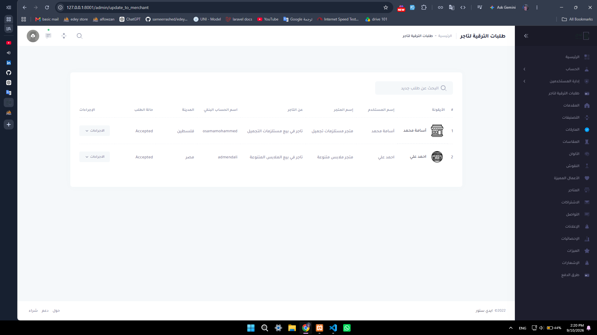
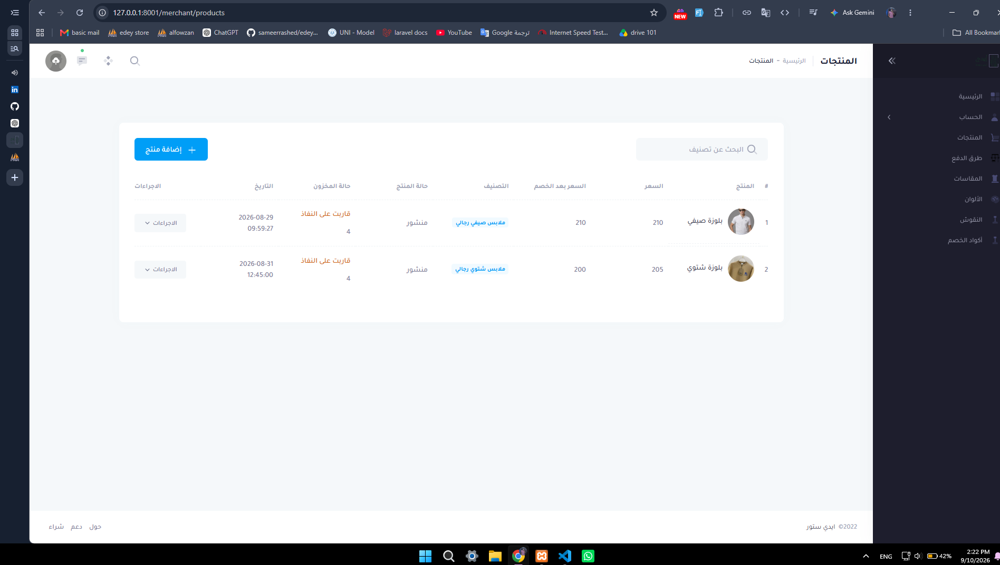
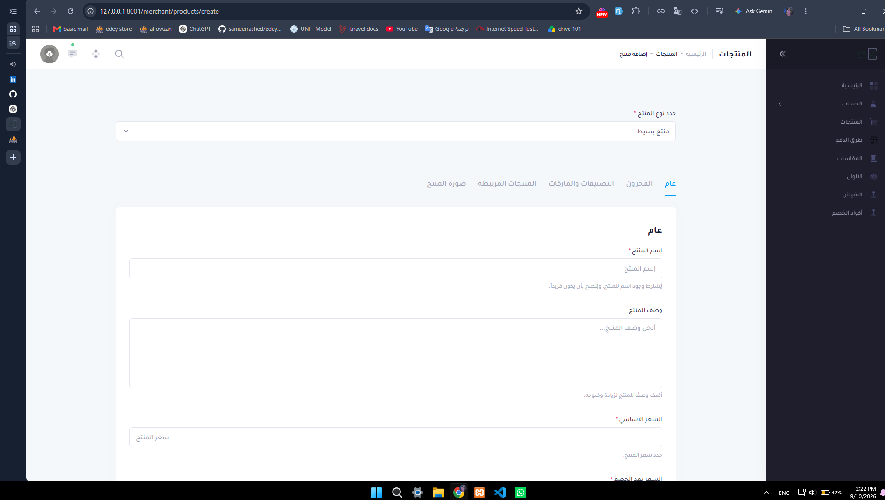

# Edey Store 🛒

Edey Store is a multi-vendor e-commerce platform built with Laravel.

The project includes separate dashboards for administrators and merchants, allowing merchants to manage their own stores, products, inventory, and payment methods while administrators manage the overall platform.

## 🚀 Main Features

- Multi-vendor e-commerce system
- Admin dashboard
- Merchant dashboard
- Store management
- Product management
- Product categories
- Product attributes and variants
- Colors, sizes and patterns
- Inventory management
- Shopping cart
- Orders management
- Coupons and discounts
- Payment methods
- User roles and permissions
- Arabic RTL interface
- AJAX-based interactions

## 🛠 Technologies

- PHP
- Laravel 12
- MySQL
- Blade
- JavaScript
- jQuery
- AJAX
- Bootstrap
- Metronic
- HTML / CSS
- Git / GitHub

## 🏗 System Structure

The platform contains multiple user roles:

### Admin

The administrator manages the overall platform including users, merchants, categories, and system settings.

### Merchant

Each merchant can manage their own store, including products, inventory, product attributes, and available payment methods.

### Customer

Customers can browse products, add products to the shopping cart, apply coupons, and place orders.

## 📦 Product Management

Products can contain multiple attributes such as:

- Colors
- Sizes
- Patterns
- Engravings
- Product variants
- Inventory quantities

Each product can also contain multiple images and categories.

## 🛒 Shopping Cart

The shopping cart supports products from different stores and calculates totals separately for each store.

Coupons can also be applied according to the selected store.

## 🌍 Localization

The platform is designed primarily for Arabic users and supports RTL layouts.

## 📸 Screenshots

### Request upgrade merchant

### Product Management

### Add Simple Product

### Add Multiple Product

## License

The Laravel framework is open-sourced software licensed under the [MIT license](https://opensource.org/licenses/MIT).
